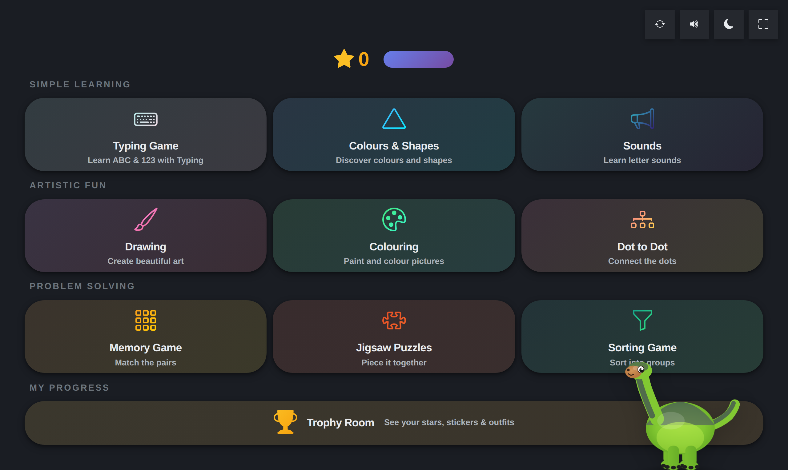
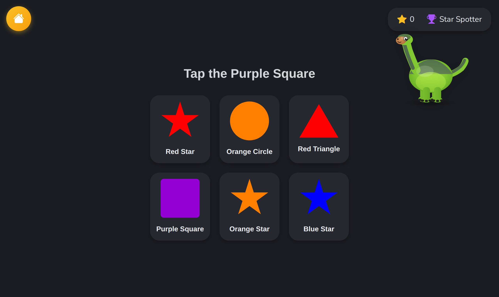
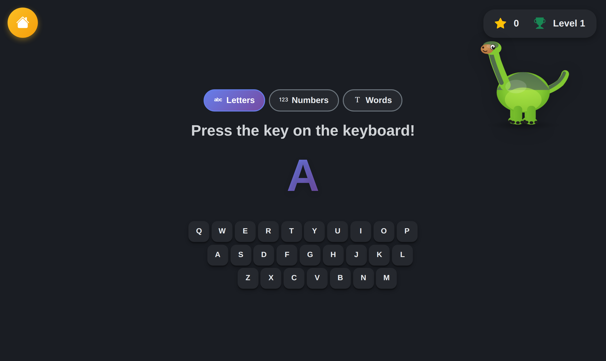

# Toddler Typing

Nine offline learning activities for ages 2–5, fronted by a talking dinosaur — on a
desktop or an Android tablet, with no ads, no accounts and no network.

## Why this exists

Hand a two-year-old a laptop and two things happen. They leave the app within
seconds — Alt+Tab, the Windows key, a swipe from the edge — and you spend the session
being tech support instead of watching them learn. And almost every "free kids app"
pays for itself with ads and data collection, aimed at someone who cannot possibly
consent to either.

So this one locks the keyboard, runs fullscreen, and never opens a socket. There is
nothing to sign into, nothing to buy, and nothing leaves the device. The design rule
that follows from a toddler as the user is simple: **any change has to survive random
mashing**, because that is the actual input method.

## What it looks like


*The menu: nine activities in three groups, a star counter, and the trophy room.
Everything is a large, high-contrast target — there are no small controls anywhere in
the app.*


*Colours & Shapes: a spoken prompt and six tiles. Wrong answers do nothing punitive —
the dinosaur just asks again.*


*The typing game with its on-screen keyboard, in Letters mode. Numbers and Words
unlock as levels progress.*

## What it does

| Activity | What the child does |
|---|---|
| Typing Game | Press the letter, number or word shown, on a real or on-screen keyboard |
| Colours & Shapes | Tap the named colour/shape from a set of tiles |
| Sounds | Phonics — hear a letter sound and match it |
| Drawing | Free canvas with a colour palette and brush sizes |
| Colouring | Fill pre-drawn pictures |
| Dot-to-dot | Join numbered dots |
| Memory | Card-matching pairs |
| Jigsaw | Drag pieces into place, with a completion celebration |
| Sorting | Group items by an attribute |

Plus a **trophy room** collecting stars earned across the activities.

Under the hood:

- **Offline neural TTS.** The dinosaur's voice is synthesised on-device by
  sherpa-onnx, on a worker thread with an 80-entry phrase cache so speech never
  blocks the UI. No cloud speech service, so no audio leaves the machine.
- **A dinosaur that reacts** — 3D via Three.js with an automatic 2D fallback, a phrase
  bank, and an idle nudge when nothing has happened for a while.
- **Escape-proofing on Windows:** system keys are intercepted and the window is held
  fullscreen. *This part is Windows-only* — on Linux and macOS the app still runs
  fullscreen but cannot block the OS shortcuts.
- **One codebase, two platforms.** Android is a Kotlin WebView wrapper around the same
  web assets, kept in sync by `npm run sync-android` (enforced by a pre-commit hook).
- Auto-update from GitHub Releases.

## How to use it

```bash
npm install
npm run setup:tts      # downloads the ~195 MB neural voice model into resources/
npm start              # opens the app
```

`setup:tts` is optional — without it everything works except the dinosaur's voice.

Building installers uses **electron-builder**:

```bash
npm run dist           # current platform
npm run dist:win       # or dist:linux / dist:mac
npm run sync-android   # copy the web assets into the Android project
```

Android additionally needs Android Studio with SDK API 34. Node 20+ throughout.

---

## Project layout

```
electron/            main process, IPC, keyboard lock, TTS engine + worker
src/toddler_typing/web/
  index.html         the shell; every activity is a module loaded here
  js/activities/     one file per activity
  js/character_manager*.js   the dinosaur (3D, and the 2D fallback)
  assets/            character art, sounds, images
android/             Kotlin WebView wrapper (assets synced from the above)
resources/tts-model/ downloaded voice model — gitignored, fetched by setup:tts
```

## The dinosaur's voice

The engine can *clone* a voice from a short reference recording placed at
`resources/voice/reference-voice.wav`. **That file is deliberately not distributed** —
it is a real person's voice, and it is gitignored rather than shipped. Without it the
engine falls back to the model's default voice, which is what any clone of this repo
will get. If you want your own cloned voice, drop your own recording at that path
before running `setup:tts`.

## Safety and privacy

- **No network calls at runtime**, no telemetry, no analytics, no accounts, no ads.
- Nothing is uploaded; progress and stars are stored locally.
- Speech is synthesised on-device.
- Keyboard locking is Windows-only — see `SECURITY.md` for the specifics and for how
  to report a vulnerability.

## Status

Actively developed, version 1.8.1, CI green on push and on tagged releases.

Known gaps: multiple child profiles are not built (there is a single shared
progress state), and `letters_numbers.js` is dead code superseded by the typing game.
The roadmap lists memory, puzzles and matching as planned — all three actually ship.

## Licence

MIT — see `LICENSE`.
